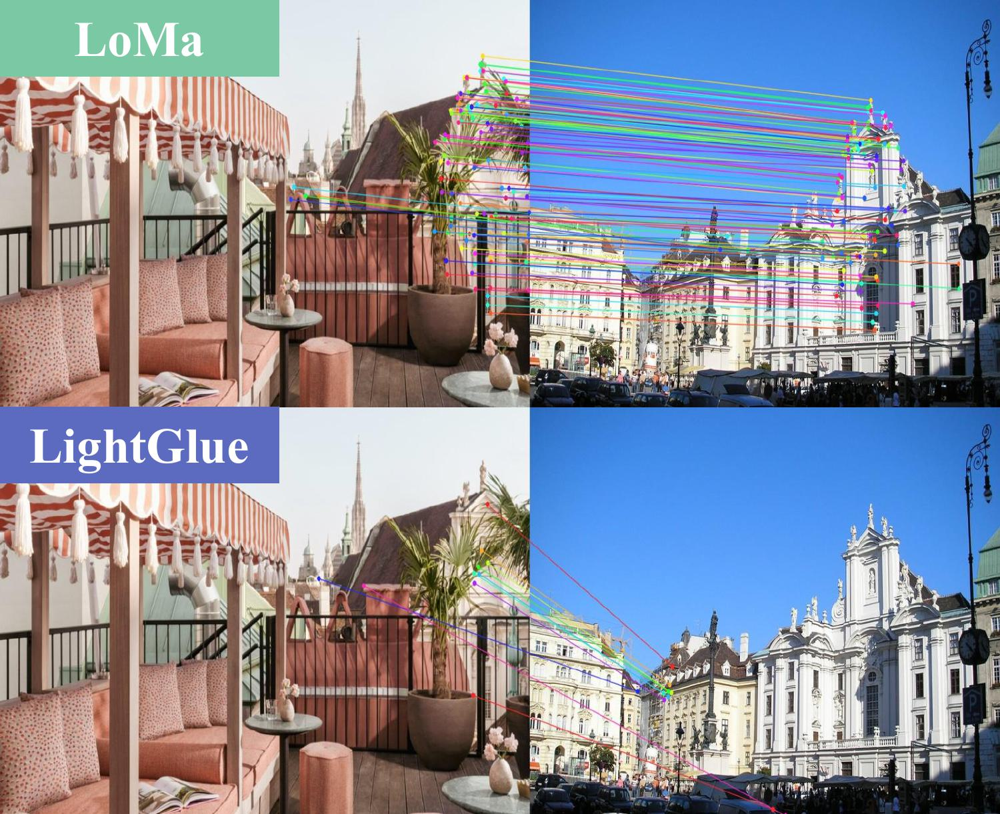

<div align="center">
<h1>LoMa: Local Feature Matching Revisited</h1>

<a href="https://arxiv.org/abs/TBD"></a>

**Chalmers University of Technology**; **Linköping University**; **University of Amsterdam**; **Lund University**

[David Nordström*](https://scholar.google.com/citations?user=-vJPE04AAAAJ), [Johan Edstedt*](https://scholar.google.com/citations?user=Ul-vMR0AAAAJ&hl), [Georg Bökman](https://scholar.google.com/citations?user=FUE3Wd0AAAAJ), [Jonathan Astermark](https://scholar.google.com/citations?user=dsEPAvUAAAAJ), [Anders Heyden](https://scholar.google.com/citations?user=9j-6i_oAAAAJ), [Viktor Larsson](https://scholar.google.com/citations?user=vHeD0TYAAAAJ), [Mårten Wadenbäck](https://scholar.google.com/citations?user=6WRQpCQAAAAJ), [Michael Felsberg](https://scholar.google.com/citations?user=lkWfR08AAAAJ), [Fredrik Kahl](https://scholar.google.com/citations?user=P_w6UgMAAAAJ)
</div>

<p align="center">
    
    <br>
    <em>LoMa matches sparse local features, similar to LightGlue, achieving significantly improved performance.</em>
</p>

## Updates

- [March 29, 2026] LoMa inference code released. 

## How to Use
```python
from loma import create_model

# load pretrained model
model = create_model("loma_B") # [loma_B128, loma_B, loma_L, loma_G]
# Define image paths, e.g.
img_A_path, img_B_path = "assets/0015_A.jpg", "assets/0015_B.jpg"
# Extract matching keypoints in image coordinates
kptsA, kptsB = model.match(img_A_path, img_B_path)

# Find a fundamental matrix (or anything else of interest)
F, mask = cv2.findFundamentalMat(
    kptsA, kptsB, ransacReprojThreshold=0.2, method=cv2.USAC_MAGSAC, confidence=0.999999, maxIters=10000
)
```
We provide additional code examples in [demo.py](demo.py), which might help in understanding.

## Setup/Install
In your python environment (tested on Linux python 3.12), run:
```bash
uv pip install -e .
```
or 
```bash
uv sync
```

## Benchmarks
We initially provide code for evaluating on MegaDepth, ScanNet, WxBS and RUBIK. If you do not already have MegaDepth1500 and ScanNet1500, you may run the following to download them:
```bash
source scripts/eval_prep.sh
```
To run a benchmark you need to install the optional dependencies by e.g. `uv sync --extra eval`. Thereafter, you can use the following call signature:
```bash
uv run eval.py --name loma_B --benchmark mega1500
```
### Expected Results
The results are similar to those reported in the paper. E.g., when we run the above command we get `Mega-1500: [55.7, 71.8, 83.6]`, which is similar to the results in the paper.

## Checklist
- [x] Publish the inference code
- [ ] Provide training code
- [ ] Release HardMatch

## License
All our code except the matcher, which inherits its license from LightGlue, is MIT license. LightGlue has an [Apache-2.0](https://github.com/cvg/LightGlue/blob/main/LICENSE) license.

## Acknowledgement
Thanks to [parskatt](https://github.com/Parskatt) for writing most of the code. Our codebase structure is mainly based on [RoMaV2](https://github.com/Parskatt/RoMaV2) and our architectures build on [LightGlue](https://github.com/cvg/lightglue), [DeDoDe](https://github.com/Parskatt/DeDoDe), and [DaD](https://github.com/Parskatt/dad). 

## BibTeX
If you find our models useful, please consider citing our paper!
```
TBD
```
